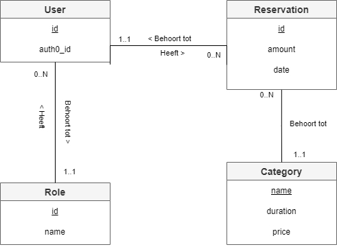
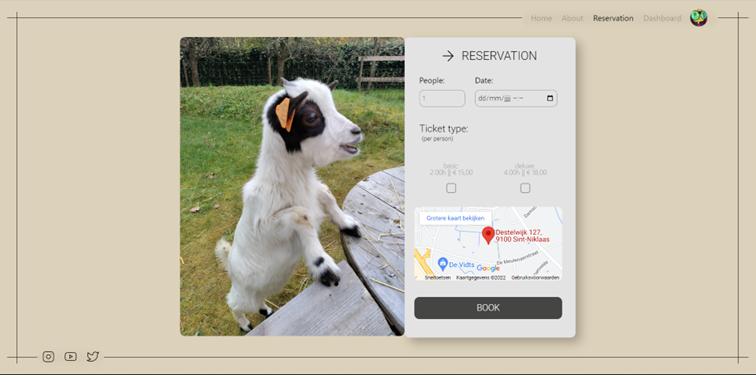
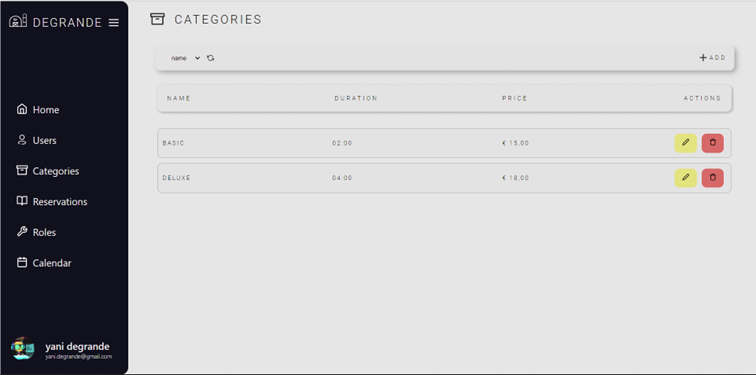

# Yani Degrande (202185045)

- [x] Front-end Web Development
  - [GitHub repository](https://github.com/Web-IV/2223-frontendweb-Yani-Degrande)
  - [Online versie](https://web-iv-2223-frontend-web-yani-degrande.onrender.com)
- [x] Web Services: GITHUB URL
  - [GitHub repository](https://github.com/Web-IV/2223-webservices-Yani-Degrande)
  - [Online versie](https://web-iv-2223-webservices-yani-degrande.onrender.com)

**Logingegevens**

- Gebruikersnaam/e-mailadres: `e2e-testing@degrande-farm.be`
- Wachtwoord: `Degrandefarm_test`

## Projectbeschrijving

Ik heb een website voor een kinderboerderij gemaakt. Op deze website kan u als gebruiker een reservatie boeken. De betaling moet ter plaatse op de kinderboerderij gebeuren. Als werknemer van de kinderboerderij heb je toegang tot het dashboard om categorieën toe te voegen / verwijderen / aanpassen.(Deze categorieën zijn een keuze die gemaakt moeten worden tijdens de reservatie).

## Screenshots

## Behaalde minimumvereisten

### Front-end Web Development

- **componenten**

  - [x] heeft meerdere componenten - dom & slim (naast login/register)
  - [x] definieert constanten (variabelen, functies en componenten) buiten de component
  - [x] minstens één form met validatie (naast login/register)
  - [x] login systeem (eigen of extern zoals bv. Auth0)
         

- **routing**

  - [x] heeft minstens 2 pagina's (naast login/register)
  - [x] routes worden afgeschermd met authenticatie en autorisatie
         

- **state-management**

  - [x] meerdere API calls (naast login/register)
  - [x] degelijke foutmeldingen indien API call faalt
  - [x] gebruikt useState enkel voor lokale state
  - [x] gebruikt Context, useReducer, Redux… voor globale state
         

- **hooks**

  - [x] kent het verschil tussen de hooks (useCallback, useEffect…)
  - [x] gebruikt de hooks op de juiste manier
         

- **varia**
  - [x] een aantal niet-triviale testen (unit en/of e2e en/of ui)
  - [x] minstens één extra technologie
  - [x] duidelijke en volledige README.md
  - [x] volledig en tijdig ingediend dossier

### Web Services

- **datalaag**

  - [x] voldoende complex (meer dan één tabel)
  - [x] één module beheert de connectie + connectie wordt gesloten bij sluiten server
  - [x] heeft migraties
  - [x] heeft seeds
         

- **repositorylaag**

  - [x] definieert één repository per entiteit (niet voor tussentabellen) - indien van toepassing
  - [x] mapt OO-rijke data naar relationele tabellen en vice versa
         

- **servicelaag met een zekere complexiteit**

  - [x] bevat alle domeinlogica
  - [x] bevat geen SQL-queries of databank-gerelateerde code
         

- **REST-laag**

  - [x] meerdere routes met invoervalidatie
  - [x] degelijke foutboodschappen
  - [x] volgt de conventies van een RESTful API
  - [x] bevat geen domeinlogica
  - [x] degelijke authorisatie/authenticatie op alle routes
         

- **varia**
  - [x] een aantal niet-triviale testen (min. 1 controller >=80% coverage)
  - [x] minstens één extra technologie
  - [x] duidelijke en volledige `README.md`
  - [x] maakt gebruik van de laatste ES6-features (object destructuring, spread operator...)
  - [x] volledig en tijdig ingediend dossier

## Projectstructuur

### Front-end Web Development

- front_end
  - cypress
    - downloads
    - e2e
    - fixtures
    - support
  - node_modules
  - public
  - src
    - api
    - assets
      - fonts
      - images
    - components
      - Authentication
        - AuthenticationButton
        - AuthentLanding
        - LoginButton
        - LogoutButton
      - Categories
        - Category
      - Dashboard
      - Layout
      - Error
      - Loader
      - Modal
      - Navbar
      - Sidebar
      - Socials
    - contexts
    - scenes
      - About
      - DashboardHome
      - Reservations
        - Category
      - Home
      - NotFound

### Web Services

- web_services
  - tests
    - rest
  - assets
    - images
  - config
  - coverage
  - node_modules
  - src
    - core
    - data
      - migrations
      - seeds
    - repository
    - rest
    - service

## Extra technologie

### Front-end Web Development

Als extra technologie gebruik ik Toastify.
Toastify maakt het voor mij mogelijk om notificaties toe te voegen aan mijn applicatie zonder problemen.

[Toastify notifications](https://www.npmjs.com/package/react-toastify)

### Web Services

Als extra technologie gebruik ik Nodemailer.
Nodemailer zorgt ervoor dat ik emails kan versturen via Node.js

[Nodemailer](https://www.npmjs.com/package/nodemailer)

## Testresultaten

### Front-end Web Development

- addcategory
  - Voeg een correcte category toe
  - Probeer een category toe te voegen zonder name
  - Probeer een category toe te voegen zonder duration
  - Probeer een category toe te voegen zonder price
  - Probeer een category toe te voegen met een te korte name
  - Probeer een category toe te voegen met een prijs die kleiner dan of gelijk is aan 0
  - Probeer een category toe te voegen met een rpijs groter dan 5000
- login
  - Probeer in te loggen
  - Probeer uit te loggen
- addreservation
  - Voeg een correcte reservation toe
  - Probeer een foutieve datum in te geven
- categories
  - Toon alle categories
  - Toon de loader als de categories traag inladen
  - Kan ik alles aanklikken in de order by

### Web Services

- Roles
  - Krijg alle roles
  - Krijg een role by ID
  - Maak een nieuwe role
  - Update een role
  - Verwijder een role
- User
  - Krijg alle users
  - Krijg users by auth0_id
  - Update een user
  - Verwijder een user
- Category
  - Krijg alle categories
  - Krijg een category by name
  - Verwijder een category
  - Update een category
- Reservation
  - Krijg alle reservations
  - Krijg een reservation by ID
  - Verwijder een reservation

## Gekende bugs

### Front-end Web Development

- Als Dashboard tab niet meteen zichtbaar is na inloggen als admin -> refresh page.

### Web Services

- Als testen niet meteen allemaal slagen -> opnieuw runnen
